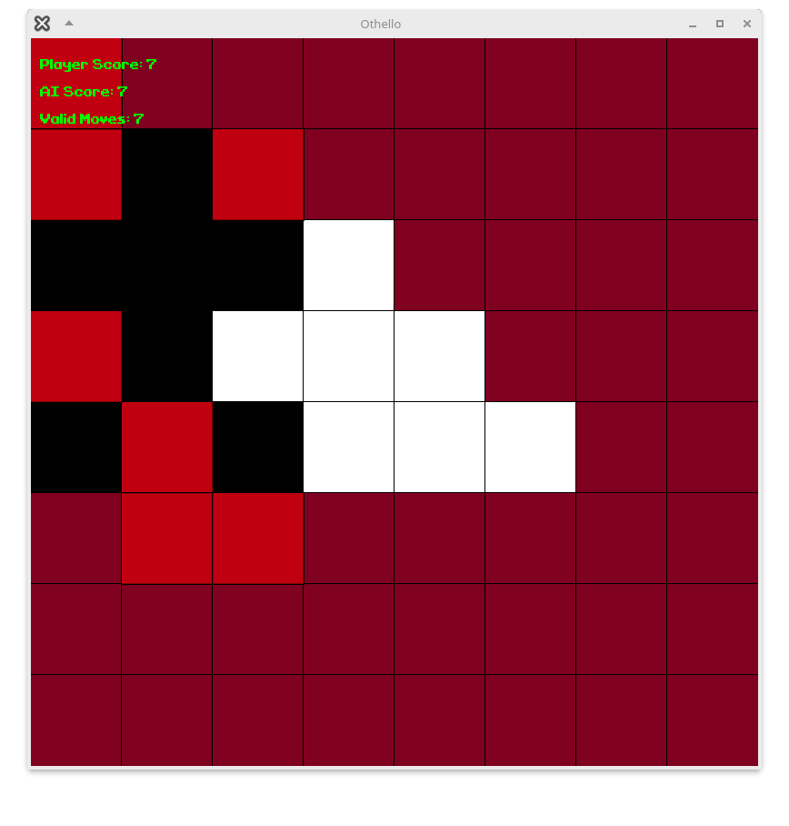

# The Moor of Venice

Welcome to **The Moor of Venice**! This README will guide you through the process of setting up, building, and running the game.
## Description

**The Moor of Venice** is an immersive and captivating strategy game inspired by the timeless classic, Othello. Step into a world of rich history and challenge your tactical skills as you outwit opponents, claim territory, and dominate the board in a battle of wits and strategy.

## Features

- Rich, historical theme
- Strategic gameplay
- Stunning graphics
- Engaging AI opponents



## Dependencies

To build and run the game, you need the following dependencies:

- SFML
- CMake

### Install Dependencies on Ubuntu 24.04

Use the following command to install the necessary dependencies:

```bash
sudo apt install git make g++ libsfml-dev cmake
```

## Build and Run the Game

Follow these steps to compile and run the game:

1. Create a build directory:
    ```bash
    mkdir build
    cd build
    ```

2. Generate the build files using CMake:
    ```bash
    cmake ..
    ```

3. Compile the game:
    ```bash
    make
    ```

4. Run the game:
    ```bash
    ./MyGame
    ```

## Debugging

To enable debugging, run CMake with the following option:

```bash
cmake -DCMAKE_BUILD_TYPE=Debug ..
```

## Nix Development Environment

If you are using Nix, you can set up the development environment based on the `flake.nix` file:

```bash
nix develop
```

Enjoy playing **The Moor of Venice**!


